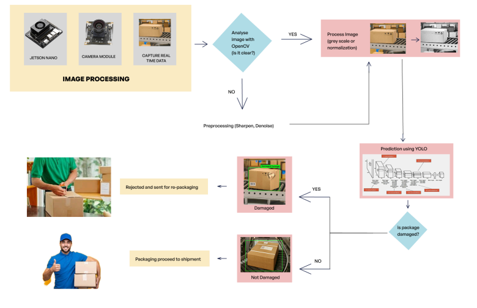

# 🧠 EdgeAI Package Defect Detection Using YOLOv11 🚀

This repository contains the implementation of a real-time, edge-deployed smart vision system for industrial **packaging defect detection**, using **YOLOv11** on **NVIDIA Jetson Nano**. The system ensures high-speed and low-latency quality inspection using **multi-camera input**, **OpenCV-based preprocessing**, and **on-device AI inference**.

---

## 📌 Key Features
- 🎯 Real-time defect classification (Damaged / Not Damaged)
- 🔎 Multi-camera setup to eliminate blind spots
- 🧠 YOLOv11 fine-tuned on custom dataset
- ⚙️ Edge-optimized inference with TensorRT + Jetson Nano
- 🖼️ OpenCV preprocessing (blur removal, brightness normalization)
- 🚚 Automatic sorting for factory conveyor belt setups

---

## 🛠️ Tech Stack
- **Jetson Nano** (Edge AI device)
- **YOLOv11** (Object detection model)
- **Python + OpenCV** (Image processing)
- **TensorRT / DeepStream** (Optimized inference)
- **Roboflow + Label Studio** (Data annotation & augmentation)

---

## 🖼️ System Workflow

  

---

## ⚙️ Hardware Architecture
- **Jetson Nano**: Low-power GPU-enabled edge computing
- **3 Camera Modules**: Top and two side views for complete coverage
- **Conveyor System**: Simulates factory environment
- **Actuated Sorting Arm**: Redirects damaged packages

---

## 📈 Results
| Metric | YOLOv11 (Proposed) | YOLOv5s (Baseline) |
|--------|---------------------|--------------------|
| Accuracy | **95%** | 82.5% |
| Precision | 92% | 81.8% |
| mAP@0.5 | **93%** | 78.6% |

---

## 🧪 Dataset & Training
- **Custom dataset** with 200+ annotated images
- Data augmentation: brightness/rotation/blur variations
- Trained for **100 epochs** using Ultralytics YOLOv11
- Exported `.pt` weights for edge inference

---

## 📦 Outputs
- 📹 Annotated live video feed with bounding boxes
- 🟩 Package status: “Damaged” or “Not Damaged”
- 🤖 Automated sorting and UI display

---

## 📲 Future Work
- Predictive maintenance integration
- Cloud dashboard for remote monitoring
- Defect type classification (dent, tear, deformation)
- Mobile app UI for real-time alerting

---

## 👨‍💻 Authors
- Prashik S. Maghade – `prashikmaghade@gmail.com`
- Shivi Koshti – `shivikoshti123@gmail.com`
- Shlok Naik – `shloknaik1903@gmail.com`
- Rutuja Navale – `rutujanavale2004@gmail.com`
- Harikrishnan R (Guide) – `dr.rhareish@gmail.com`
- Akshay Bhosale (Guide) – `agbhosale18@gmail.com`

---

